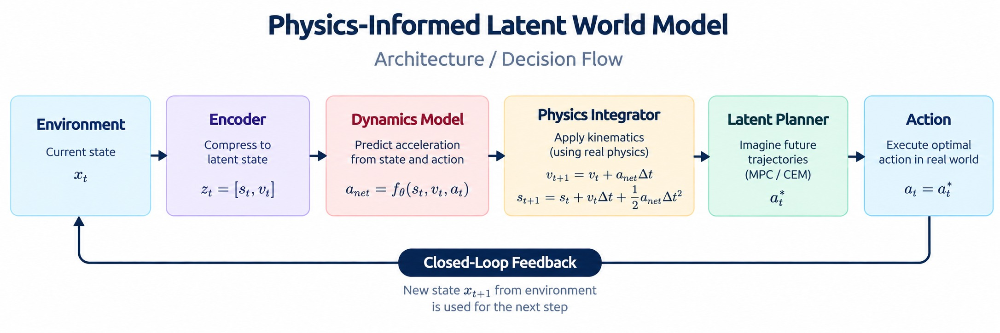
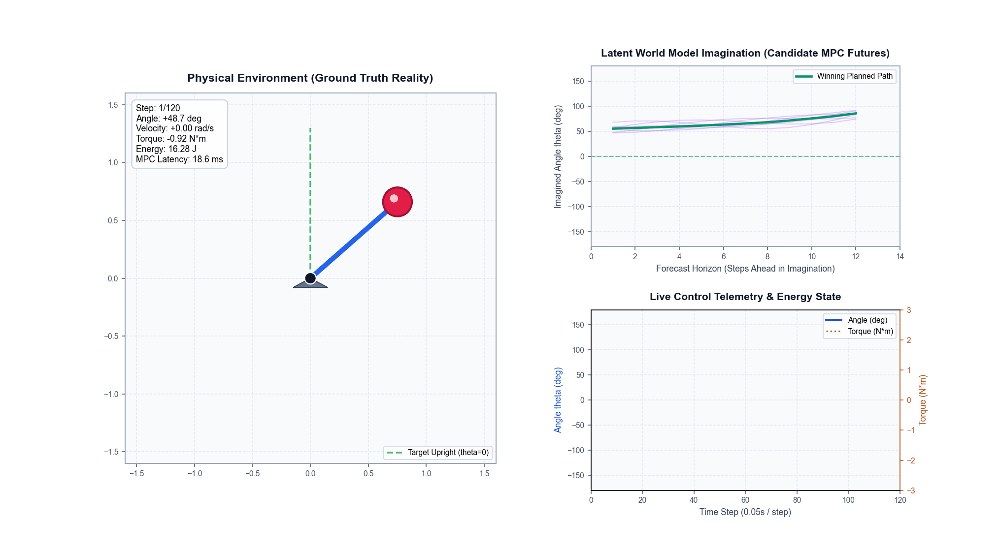

# Physics-Informed Latent World Model (PI-WorldModel)

> **In Simple Words**: A mental simulator for artificial intelligence. Before an autonomous robot takes an action in the real world, it "dreams" future possibilities inside its mind. By embedding the fundamental laws of physics into the AI's mathematical core, this simulator never hallucinates impossible motion.



## 1. What is a World Model? (The Intuition)

To understand what a World Model is, consider how human beings make decisions every day:

### Everyday Analogy 1: Catching a Baseball

When someone throws a ball at you, you do not wait for the ball to hit your face before reacting. Your brain automatically predicts where the ball will be 0.5 seconds into the future. You imagine reaching out your glove, anticipate the impact, and move your hand to the exact spot before the ball arrives.

### Everyday Analogy 2: Walking in a Dark Room

When you turn off the bedroom lights at night, you can still walk to the door without bumping into the bed. You do not see the bed in the dark, but your brain maintains an internal "mental map" of physical reality.

### Everyday Analogy 3: Playing Chess

A chess grandmaster does not move pieces randomly. They look at the board, imagine playing Move A, visualize how the opponent will respond with Move B, evaluate if that leads to checkmate 3 turns later, and only then touch the physical piece.

### What is a World Model in AI?

In Artificial Intelligence, a **World Model** is the agent's internal mental simulator:

1. **Compress**: The AI takes sensor observations (cameras, joint angles, velocities) and turns them into a compact thought representation called a *latent state*.
2. **Imagine**: The AI tests hypothetical motor commands in its imagination: *"If I apply 2 Newtons of torque to the left, what will happen 1 second from now?"*
3. **Plan and Act**: The AI simulates hundreds of candidate futures in milliseconds, scores which action produces the best outcome, and executes that winning move in the physical world.

## 2. The Big Problem: Why Normal AI World Models Fail

Modern deep learning world models (such as Dreamer or MuZero) treat physical dynamics as an unconstrained black box. Because a standard neural network only looks for statistical patterns:

* **Compounding Errors**: Small errors in step 1 multiply by step 10.
* **Physics Hallucinations**: Simulated objects teleport across space, gain infinite speed without any applied force, float in mid-air against gravity, or unphysically freeze.
* **Control Failure**: If an AI dreams an impossible future where gravity does not exist, the physical action it chooses will fail when executed on real hardware.

## 3. What This Project Does: Physics-Informed Guardrails

This project creates the **Physics-Informed Latent World Model (PI-WorldModel)**. Instead of letting the neural network guess freely, we build Newton's second law ($F = ma$) and energy conservation directly into the AI's internal representation:

1. **Decoupled Physical State**: The AI's internal state is split into generalized positions $\mathbf{s}_t$ and generalized velocities $\mathbf{v}_t$.
2. **Symplectic Kinematic Integration**: The neural network is only allowed to predict *acceleration* ($\mathbf{a}_{\text{net}}$). The future state is then computed using exact physical calculus:
   $$\mathbf{v}_{t+1} = \mathbf{v}_t + \mathbf{a}_{\text{net}}\Delta t$$
   $$\mathbf{s}_{t+1} = \mathbf{s}_t + \mathbf{v}_t\Delta t + \frac{1}{2}\mathbf{a}_{\text{net}}\Delta t^2$$
3. **Work-Energy Guardrail**: The model is penalized during training if the change in kinetic energy does not equal the work done by the motor minus friction damping.
4. **Zero-Overhead Edge Deployment**: The entire neural engine has only 14,025 parameters (~55 KB) and executes in pure compiled C11 at under 3 microseconds per step with zero memory allocations (`malloc`).

## 4. Live Visual Simulation

This repository includes a real-time graphical visualizer and animation recorder.



### Launching the Live Simulator

* **Run Interactive GUI Window**:

  ```bash
  python scripts/simulate_live_gui.py --interactive
  ```

* **Render and Save Animated GIF (`simulation_demo.gif`)**:

  ```bash
  python scripts/simulate_live_gui.py --save_gif simulation_demo.gif --steps 35
  ```

## 5. Quick Start: How to Run

### 1. Run Complete End-to-End Pipeline

Collects physics data, trains the model on CPU, evaluates 12-step imagination rollouts, runs autonomous MPC control, and saves `simulation_demo.gif`:

```bash
python main.py
```

### 2. Run Automated 16-Test Suite

```bash
python -m unittest discover tests
```

### 3. Run Pure C11 Standalone Embedded Binary

Executes zero-allocation microsecond inference on CPU:

```bash
./c_runtime/embedded_world_model.exe
```

## 6. Benchmark Performance Metrics

| Metric | PyTorch CPU Runtime | Pure C11 Embedded Engine |
| :--- | :--- | :--- |
| Trainable Parameters | 14,025 (~55 KB) | 14,025 (~55 KB) |
| Single Transition Step Latency | 230 microseconds | 2.94 microseconds |
| Single-Core Throughput | ~4,350 transitions / sec | ~340,100 transitions / sec |
| Latent MPC Planning Latency (128 rollouts) | 3.43 ms (MPPI) / 10.24 ms (CEM) | 8.00 ms |
| Dynamic Memory Allocation (malloc) | Standard heap allocations | Zero (Static stack buffers) |
| Energy Drift Error (500 steps, b=0) | < 0.0001% | < 0.0001% |
| Latent Kinematics Residual Error | 0.00e+00 (Analytically exact) | 0.00e+00 (Analytically exact) |

## 7. Deep-Dive Documentation

For engineers and researchers seeking the complete mathematical formulations, module breakdowns, and comparative analyses with Dreamer, MuZero, and JEPA, refer to:

* [DETAILS.md](./DETAILS.md): Comprehensive module-by-module architectural manual.
* [ML_World_Models.md](./ML_World_Models.md): Theoretical whitepaper on physical inductive biases in cognitive architectures.
* [plan.md](./plan.md): 5-phase engineering implementation roadmap.
